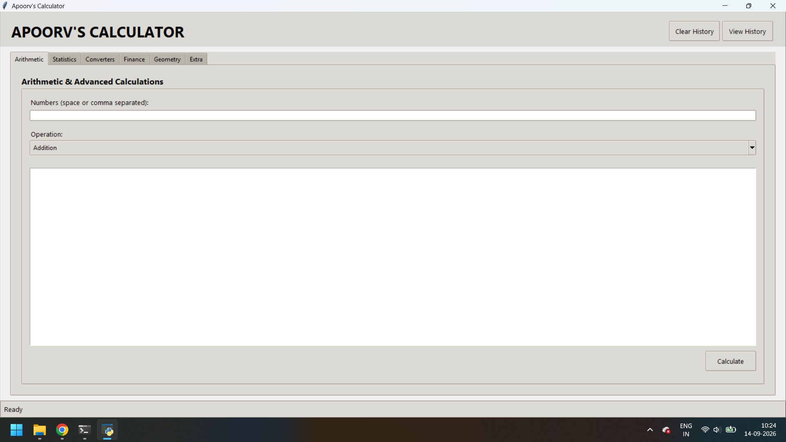

# ADVANCED_CALCULATOR

A feature-rich, multi-tab Python GUI calculator featuring advanced arithmetic, geometry, statistics, finance tools, unit/currency converters, and a built-in calculation history tracker.

## 🚀 Overview

Welcome to **Apoorv's Multi-Tool Calculator**!  
This is a comprehensive, object-oriented desktop calculator built entirely in Python using **Tkinter**.  
It goes beyond basic math to provide a wide range of utility tools — from financial calculations and statistics to custom unit conversions and history management — all wrapped in a clean, modern graphical interface.



## ✨ Features

- 🔢 **Arithmetic & Math**: Supports multi-number additions, subtractions, multiplications, divisions, trigonometric functions (sin, cos, tan, cosec, sec, cot), square/cube roots, factorials, and logarithms.
- 📐 **Geometry**: Calculate areas, perimeters, volumes, and surface areas for various 2D shapes (squares, triangles, rectangles, circles, parallelograms, trapeziums) and 3D shapes (cubes, cuboids, cylinders, spheres, cones, hemispheres).
- 📊 **Statistics**: Instantly compute Mean, Median, Mode, Variance, and Standard Deviation.
- 💰 **Finance**: Simple and Compound Interest calculators with total amount breakdowns.
- 🔄 **Unit & Currency Converters**:
  - Convert lengths, masses, temperatures, and times (with SI prefixes).
  - Multi-currency conversion based on dynamic external rate files.
- 🛠️ **Extra Utilities**: Includes a Quadratic Equation Solver and a BMI (Body Mass Index) calculator.
- 📜 **History Management**: Automatically logs all past calculations to a text file with options to view or clear history.

## ⚙️ Requirements

- Python 3.8+ installed on your system
- No external packages required (uses only standard library: `tkinter`, `math`, `statistics`, `pathlib`)

## 📥 Installation & Usage

1. **Clone the repository**
   ```bash
   git clone https://github.com/apoorvsingh-1503/apoorvs-calculator.git
   cd apoorvs-calculator
   ```

2. **Run the calculator**
   ```bash
   python calculator_gui.py
   ```

3. **(Optional) Add currency rates**  
   Create a `rates.txt` file in the same folder:
   ```
   USD United_States 83.50
   EUR Europe 90.25
   GBP United_Kingdom 105.80
   ```

## 📁 Project Structure

```
apoorvs-calculator/
├── calculator_gui.py          # Main GUI application
├── rates.txt                  # Optional currency exchange rates
├── calculator_history.txt     # Auto-generated history file
├── IMAGE_GUI_WINDOW.png       # Application screenshot
└── README.md
```

## 📝 Notes

- Trigonometric functions accept angles in **degrees**.
- Factorial works only for non-negative integers.
- Geometry module validates triangle inequality and rejects negative measurements.
- All calculations are automatically saved to `calculator_history.txt`.

## 📄 License

This project is open source and available under the [MIT License](LICENSE).

## 👨‍💻 Author

**Apoorv Singh**  
GitHub: [apoorvsingh-1503](https://github.com/apoorvsingh-1503)

⭐ Feel free to star the repository if you find it useful!
